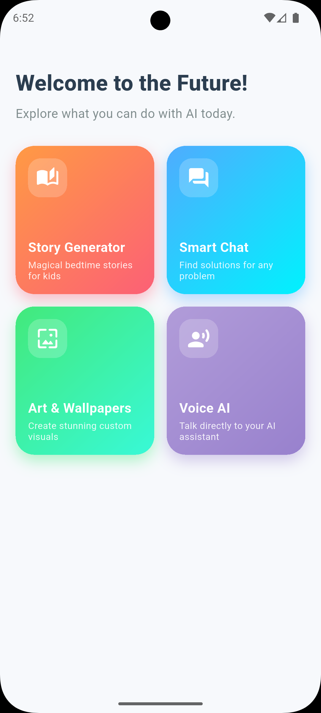
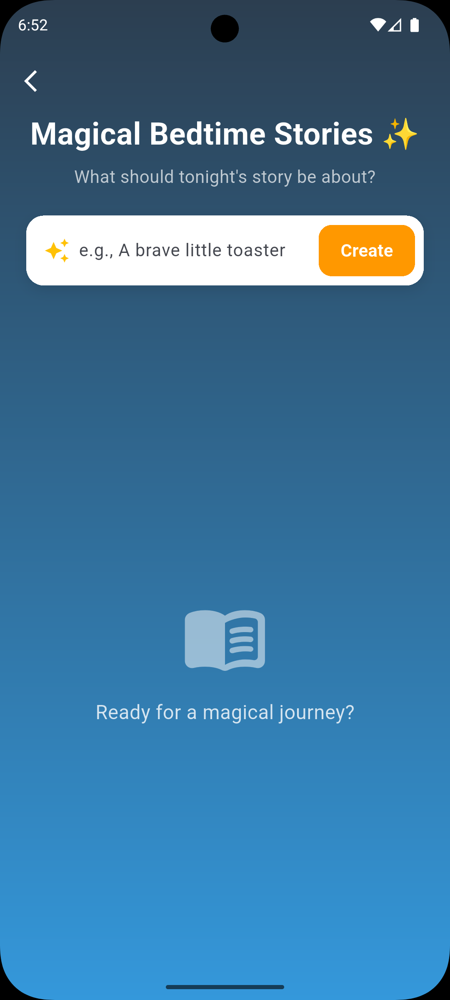
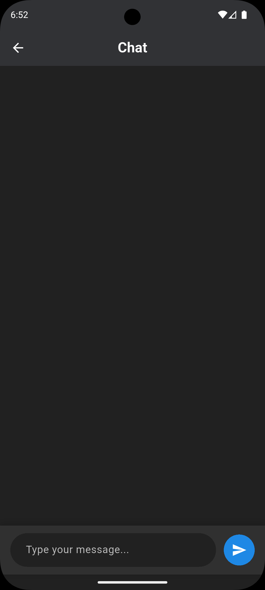
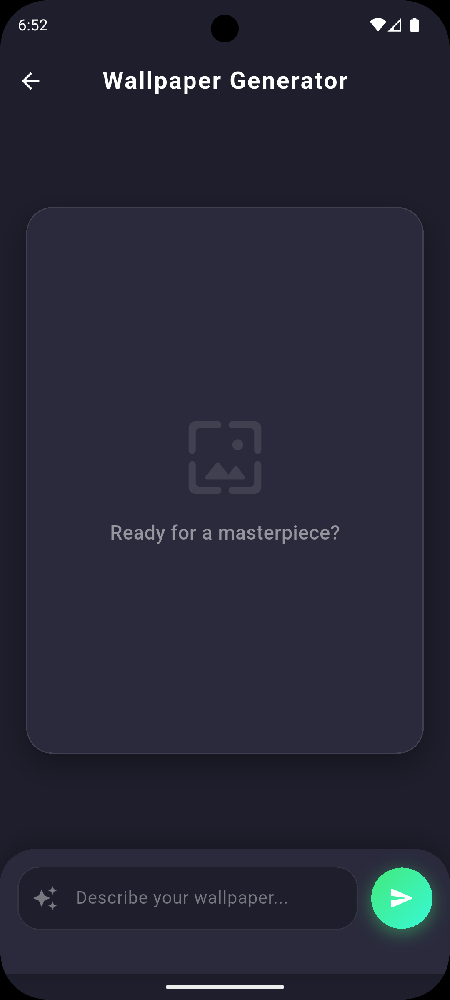
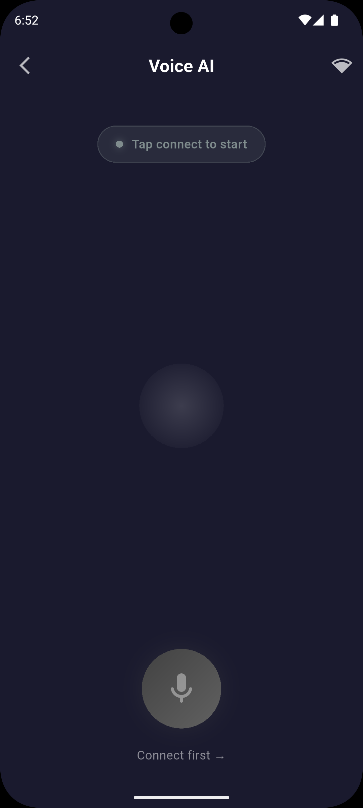

# Firebase AI Studio Sample

A Flutter application showcasing the power of the **Firebase AI Kit** by integrating various generative AI capabilities into a single, cohesive user experience. 

## Screenshots

  
  
  
  
  

## 🌟 Features

This project demonstrates 4 distinct AI modules, each tailored for a specific use case:

### 1. 📖 Story Generator (Text Generation)
Generates creative bedtime stories for children from a single user prompt. Simply enter a topic (e.g., "A brave little toaster"), and the AI crafts a full, engaging story complete with a title and narrative.

### 2. 💬 Chat (Live Chat)
An interactive chat interface that lets you communicate with the AI model just like a standard chatbot. It allows for continuous conversation and problem-solving.

### 3. 🖼️ Wallpaper Generator (Image Generation)
Creates stunning, custom wallpapers based entirely on your text input. Describe the scene or art style you want, and the AI will generate high-quality visual art for your screen.

### 4. 🎙️ Bidi (Live Voice Communication)
A voice-enabled module that allows you to communicate directly with the LLM model using your voice, creating a hands-free, natural conversation experience.

---

## 🛠️ Technology Stack

- **Framework:** [Flutter](https://flutter.dev/)
- **AI Integration:** Firebase AI Kit
- **Language:** Dart

